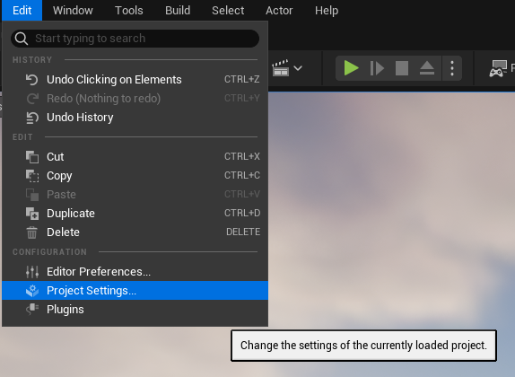
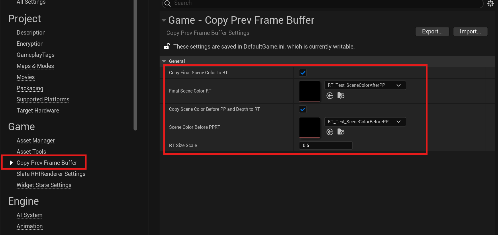

# Copy Prev Frame Buffer

Copy previous frame buffer into RT

## Description

This is a simple plugin which allows you to save previous frame's buffer into a seperate RT. This allows you to sample these RTs later.

## Getting Started

* Support Engine Version: 5.4

### Installing

* Download the plugin source and put into your Project/Plugins folder.

* Or, you can download pre-build version from repo's release page : https://github.com/ldl19691031/ClonePrevBufferToRT/releases/download/1.0/CopyPrevFrameBuffer_5.4.7z

### Setup

Open Project Settings

Click the RT you want to save, and assign a Render Target Texture.

## TODO

* Add more supported buffers

# Special Thanks

* Asher : https://x.com/Vuthric

